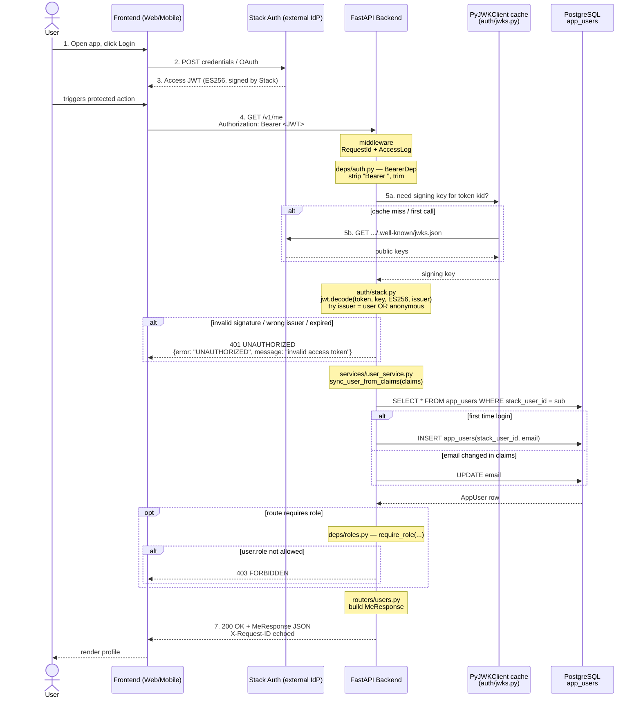
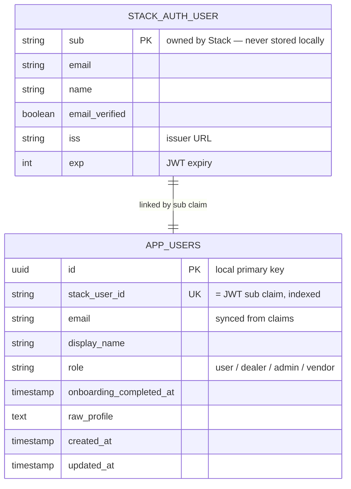
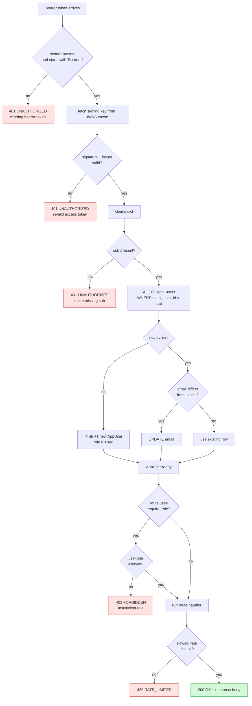

# Authentication — Flow & Data Model

## Workflow (sequence diagram)

## Data model (ER)

Stack Auth owns identity. Your DB owns one mirror table that links via Stack's `sub` claim.

### Why a mirror table

| What | Where it lives | Why |
|---|---|---|
| Email + password, MFA, OAuth, password reset | Stack Auth | We never store credentials |
| `sub` (Stack user id) | JWT claim — re-derived per request | Source of truth for identity |
| `role`, `onboarding_completed_at`, app-specific profile | `app_users` (local) | Stack doesn't know about your app's domain |
| Foreign keys from saved_diamonds, transactions, etc. | local DB → `app_users.id` | Joins stay inside Postgres |

## Request lifecycle (top-down)

## Components → files map

| Component | File |
|---|---|
| App entrypoint, middleware wiring, CORS, lifespan | [app/main.py](../app/main.py) |
| Settings (env + Stack URLs) | [app/core/config.py](../app/core/config.py) |
| Logging | [app/core/logging_config.py](../app/core/logging_config.py) |
| DB session + Base | [app/db/session.py](../app/db/session.py) |
| `AppUser` model | [app/models/user.py](../app/models/user.py) |
| Pydantic schemas (`MeResponse`, onboarding) | [app/schemas/](../app/schemas/) |
| Bearer header dep + current_user | [app/deps/auth.py](../app/deps/auth.py) |
| Role gate | [app/deps/roles.py](../app/deps/roles.py) |
| JWT verify against Stack | [app/auth/stack.py](../app/auth/stack.py) |
| JWKS cache | [app/auth/jwks.py](../app/auth/jwks.py) |
| First-login upsert / email sync | [app/services/user_service.py](../app/services/user_service.py) |
| Onboarding completion | [app/services/onboarding_service.py](../app/services/onboarding_service.py) |
| Routes — `/v1/me` | [app/routers/users.py](../app/routers/users.py) |
| Routes — `/v1/onboarding/complete` | [app/routers/onboarding.py](../app/routers/onboarding.py) |
| Routes — `/health` | [app/routers/health.py](../app/routers/health.py) |
| Request ID middleware | [app/middleware/request_id.py](../app/middleware/request_id.py) |
| Access log middleware | [app/middleware/logging_access.py](../app/middleware/logging_access.py) |
| Rate limiter | [app/limiter/rate_limit.py](../app/limiter/rate_limit.py) |
| Centralized error envelope | [app/errors.py](../app/errors.py) |

## Failure modes (what you actually see)

| Symptom | HTTP | Cause |
|---|---|---|
| `{"error":"UNAUTHORIZED","message":"missing bearer token"}` | 401 | header missing or not `Bearer ...` |
| `{"error":"UNAUTHORIZED","message":"invalid access token"}` | 401 | bad signature / expired / wrong issuer / unknown kid |
| `{"error":"UNAUTHORIZED","message":"token missing sub"}` | 401 | malformed claims |
| `{"error":"FORBIDDEN","message":"insufficient role"}` | 403 | role gate failed |
| `{"error":"RATE_LIMITED",...}` | 429 | slowapi tripped |
| `{"error":"VALIDATION_ERROR",...}` | 422 | request body / params don't match schema |
| `{"error":"INTERNAL_ERROR",...}` | 500 | unhandled — check `request_id` in logs |

Every response includes `X-Request-ID`; the same id is in the access log line, so a single grep ties browser → log → trace.
